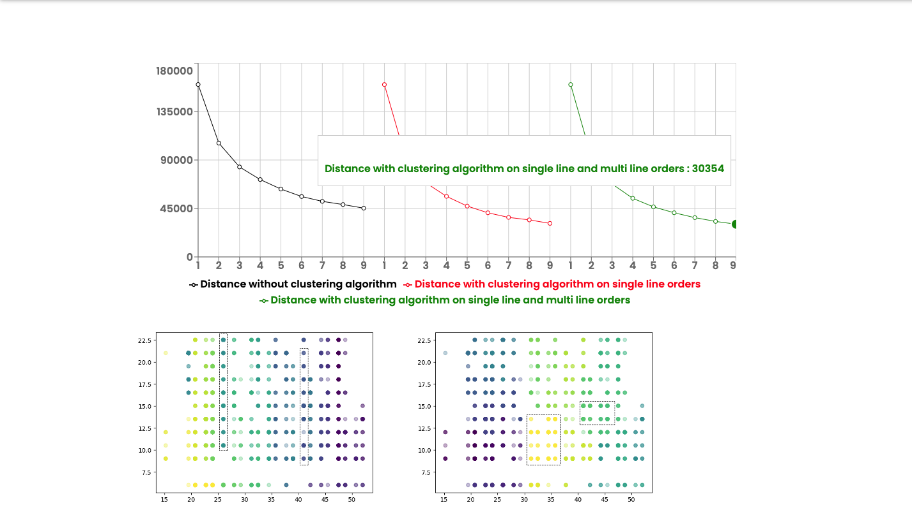
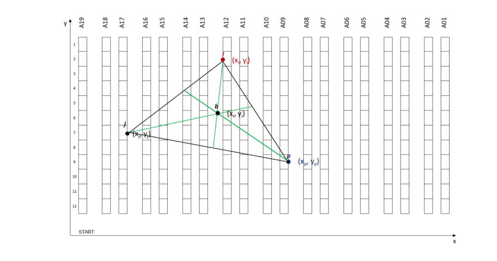
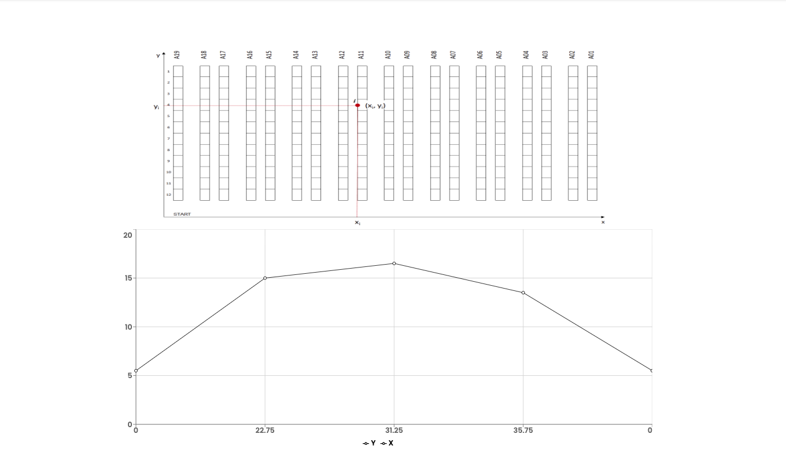
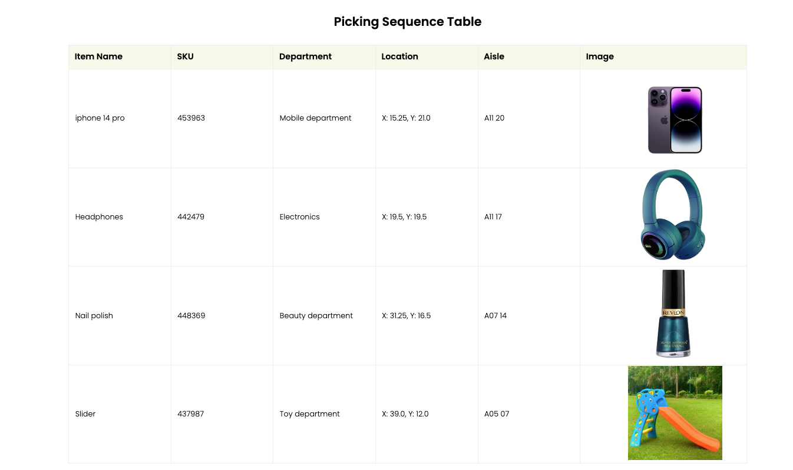

# Pick Path Optimization

## Introduction

Pick Path Optimization is an innovative solution designed to streamline and enhance the efficiency of picking processes in warehouse environments. This project combines advanced algorithms and a user-friendly interface to optimize the path taken by workers during the picking process, reducing time and increasing productivity.

## Features

- **Advanced Path Optimization Algorithms**: Utilizes Python-based scripts like `clusterSimulation.py` and `getRoute.py` to calculate the most efficient routes for picking items.
- **Interactive Frontend Interface**: A React-based frontend that allows users to input parameters and visualize optimized pick paths.
- **Data-Driven Insights**: Employs data analysis to improve path optimization over time, adapting to different warehouse layouts and item placements.

## Technology Stack

- **Backend**: Python for algorithm development and route optimization logic.
- **Frontend**: JavaScript, possibly React, for building an interactive web interface.
- **Data Analysis**: Python scripts for processing and analyzing pick path data.

## Getting Started

### Prerequisites

- Python 3.x
- Node.js and npm (for frontend)

### Installation and Setup

1. Clone the repository:
`git clone https://github.com/rithiksachdev/Pick-Path-Optimization.git`

2. Navigate to the backend directory and install Python dependencies:
`cd pick-path-optimization-backend`
`pip install -r requirements.txt`

3. Navigate to the frontend directory and install JavaScript dependencies:
`cd ../pick-path-optimization-frontend`
`npm install`

## Usage

1. Start the backend server:
`python app.py`

2. Start the frontend application:
`npm start`

3. Access the web interface at `http://localhost:3000` (or the port specified) to input parameters and view optimized pick paths.

## Contributing

Contributions to improve the Pick Path Optimization project are welcome. Whether it's enhancing the algorithm, refining the frontend, or adding new features, your input is valuable.

## License

This project is licensed under the MIT License - see the [LICENSE](LICENSE) file for details.
